# Book Tracker — Трекер прочитанных книг

**Автор:** Алиева Асият Камаловна  
  
**Версия:** 1.0

## Описание проекта

Графическое приложение (GUI) для учёта прочитанных книг с возможностью:
- Добавления книг в список (название, автор, жанр, количество страниц)
- Фильтрации по жанру (выпадающий список)
- Фильтрации по количеству страниц (больше указанного числа)
- Сохранения списка книг в JSON-файл
- Загрузки списка из JSON-файла
- Удаления выбранной книги из списка
- Проверки корректности ввода (пустые поля, число страниц)

Приложение написано на Python с использованием библиотек `tkinter`, `json`, `pathlib`.

---

## Скриншоты всех этапов работы

### 1. Главное окно приложения при запуске
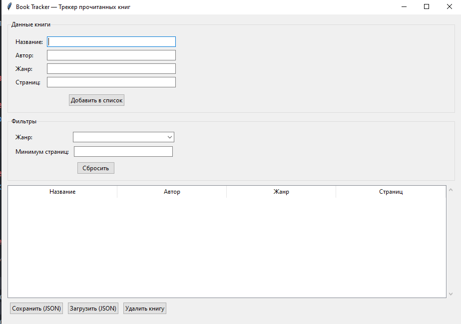

---

### 2. Добавление первой книги
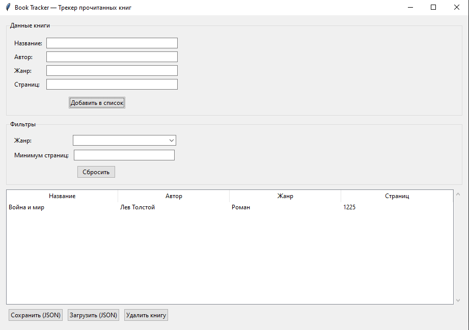

---

### 3. Добавление нескольких книг разных жанров
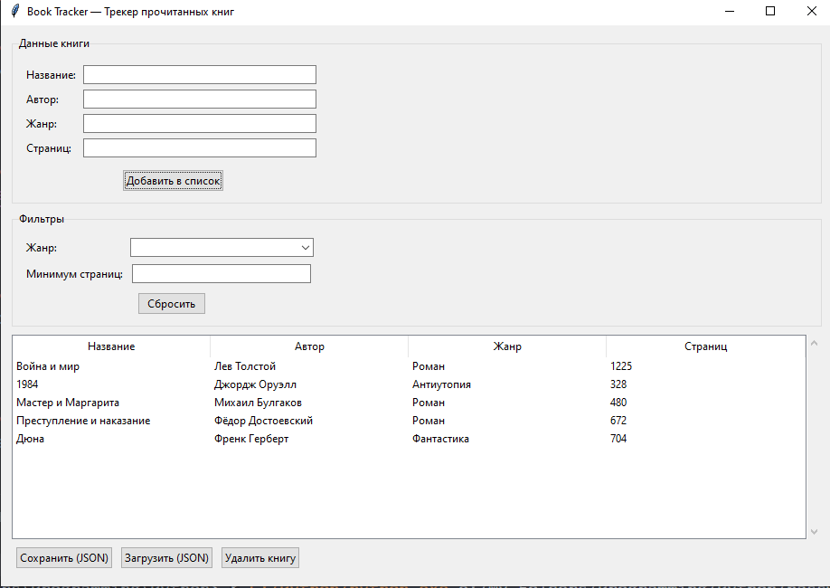

---

### 4. Фильтрация по жанру
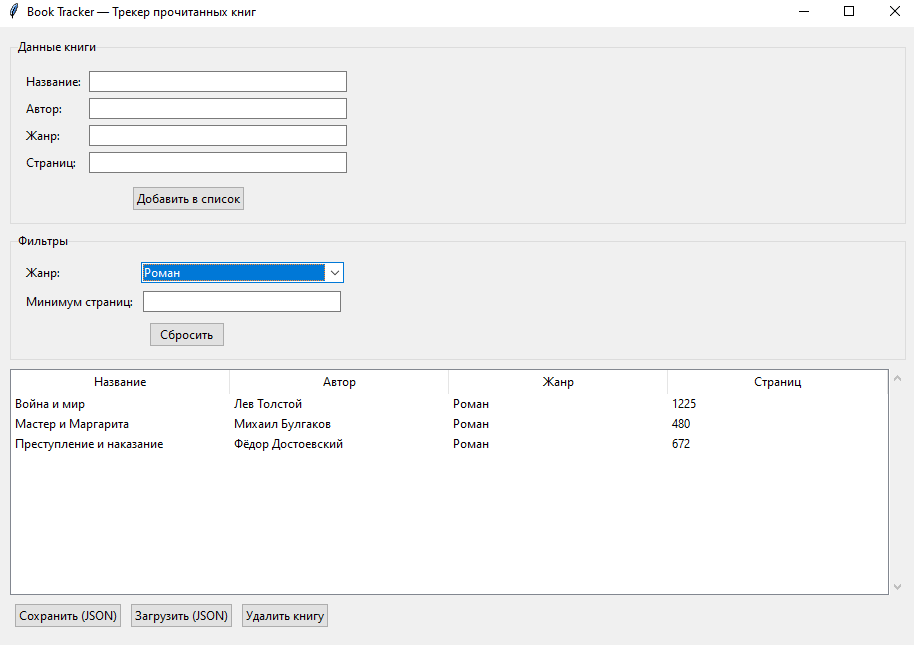

---

### 5. Фильтрация по количеству страниц
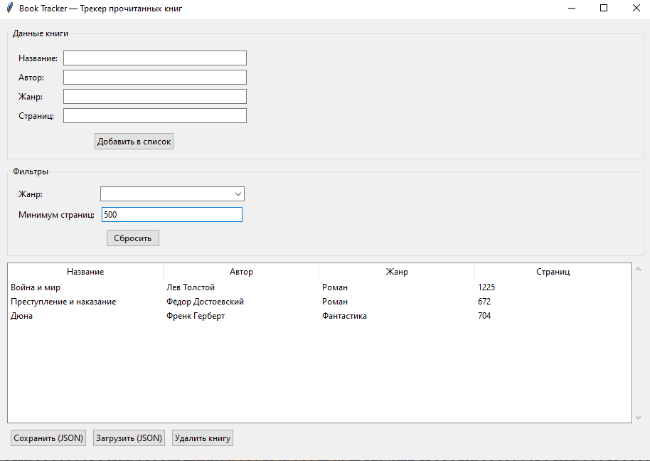

---

### 6. Проверка пустых полей (обработка ошибки)
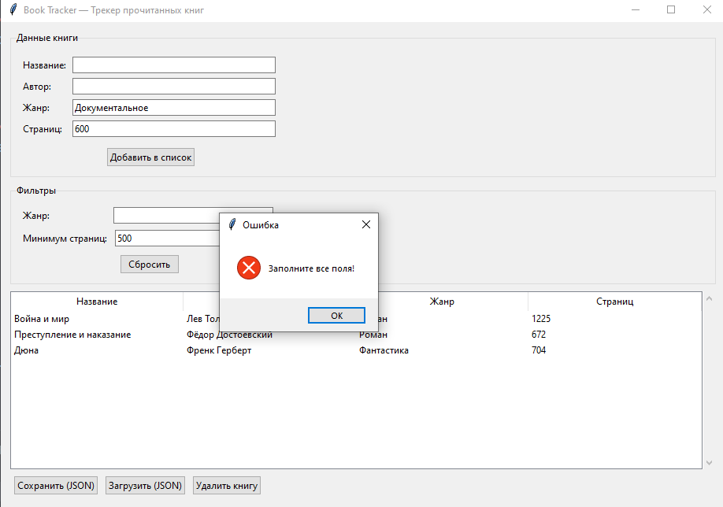

---

### 7. Сохранение данных в JSON
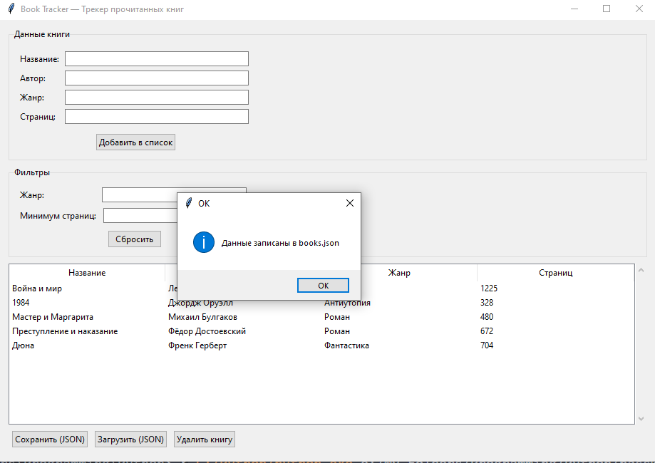

---

### 8. Структура JSON-файла
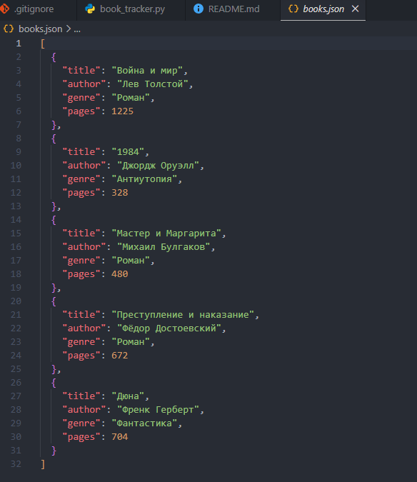

---

### 9. Удаление книги из списка
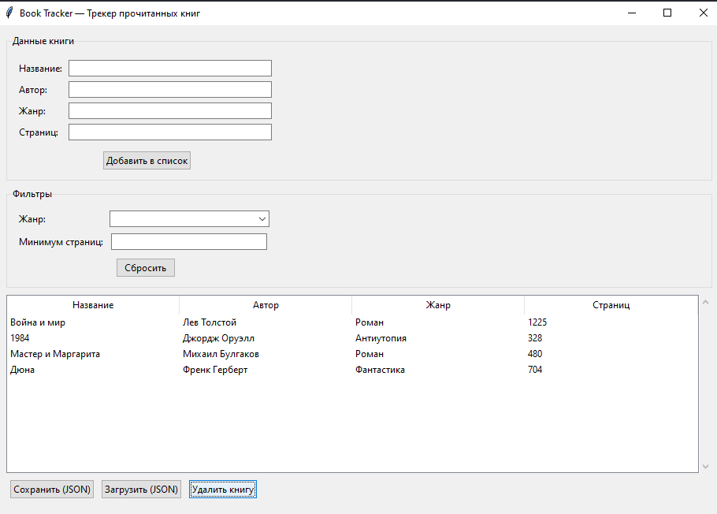

---

### 10. Попытка удаления без выбора (обработка ошибки)
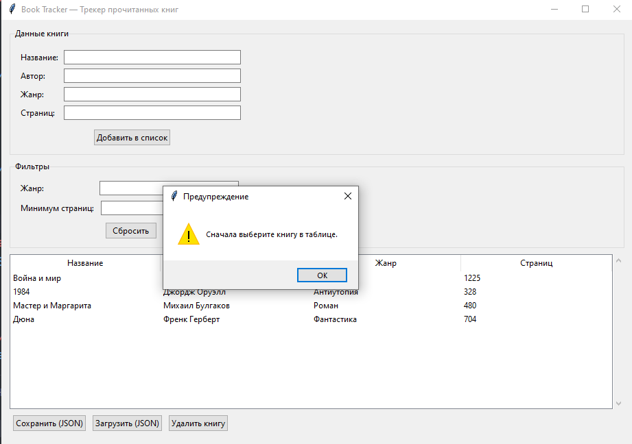

---

### 11. Загрузка данных после перезапуска
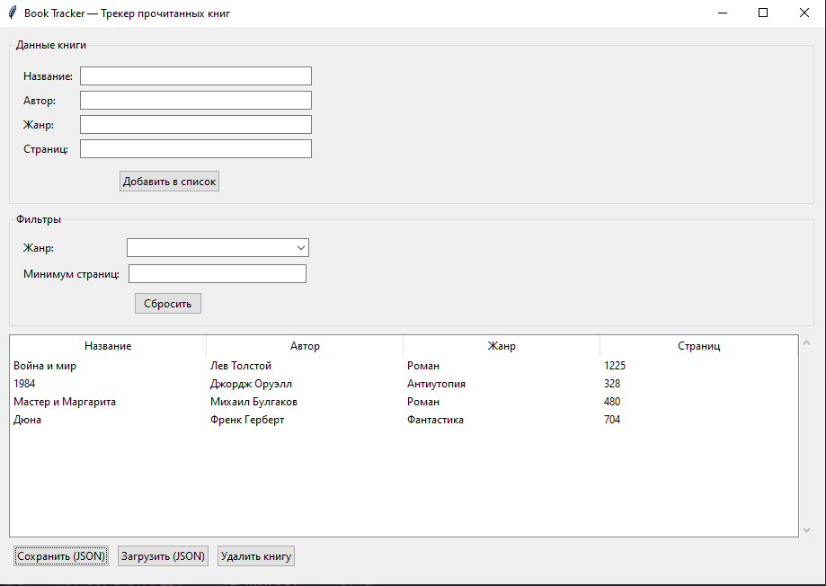

---

## Технические требования

- Python 3.8+
- Стандартные библиотеки (`tkinter`, `json`, `pathlib`) — установка не требуется

## Запуск

```bash
git clone https://github.com/AlievaAsiat/book_tracker.git
cd book_tracker
python book_tracker.py